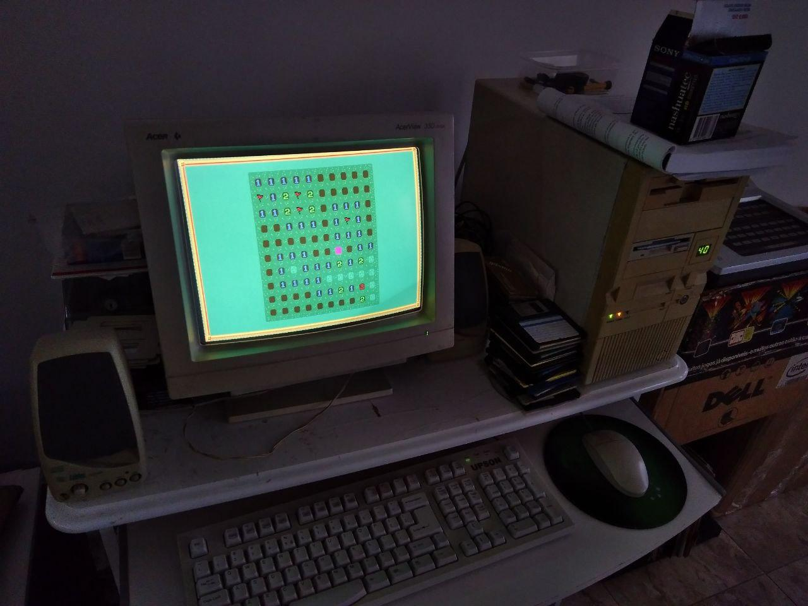

## MSDOS port

- Draws on VGA screen mode 0x13.
- Tested on DOSBOX 0.74 (you can use the `make run` for that)
- Also tested on real hardware (on an old 386 IBM-PC)

### Build & runtime/debug dependencies

* gcc-ia16 compiler

Since we currently lack Debian packages for gcc-ia16, I have built mine from sources this way:

- sudo apt install flex bison texinfo libc6-dev-i386
- cd ~/devel
- mkdir github_tkchia
- cd github_tkchia
- git clone https://github.com/tkchia/build-ia16
- cd build-ia16
- ./fetch.sh
- ./build.sh clean
- ./build.sh binutils
- ./build.sh prereqs
- ./build.sh gcc1
- ./build.sh newlib
- ./build.sh causeway
- ./build.sh libi86
- ./build.sh gcc2
- export PATH=$PATH:/home/fsanches/devel/github_tkchia/build-ia16/prefix/bin

**Note:** Adjust your PATH environment variable according to your own personal username.
