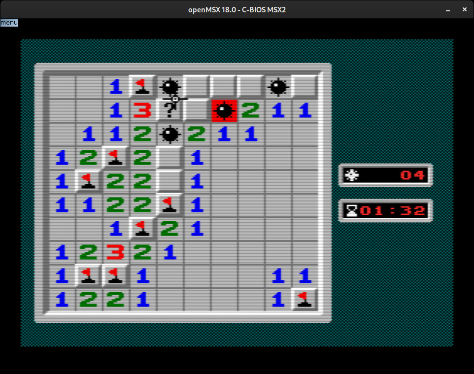
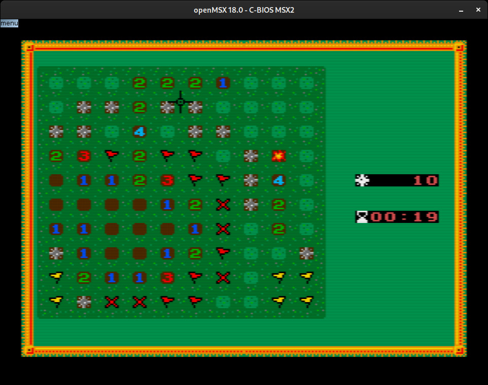

## MSX2 port



### Keys

* The arrow keys move the cursor;
* Space key opens the current cell under the cursor;
* `M` key toggles flag and question mark;
* `N` key opens multiple cells at once around the cursor;
* `Q` key reboots;

### Mouse

* Left button opens the cell under the pointer;
* Right button toggles flag and question mark under the pointer;
* Left+Right buttons open multiple cells at once under the pointer;

### OpenMSX

* Middle-click will toggle mouse input grab (confines mouse events to OpenMSX window).

### Build & runtime/debug dependencies

* SDCC compiler (successfully tested with 4.0.0, 4.1.0 and 4.2.0)
* hex2bin tool
* openMSX emulator with C-BIOS ROM

**Note:** The hex2bin tool can be compiled from sources available at https://gitlab.com/reidrac/ubox-msx-lib/-/blob/main/tools/hex2bin-2.0 or you can also use binaries downloaded from https://sourceforge.net/projects/hex2bin/files/

### Tileset selection

The default tileset is the classic windows theme (16x16), but you can select the grassland tileset (8x8) by typing the following command:
```
$ _8X8_TILES=1 make clean all
```


