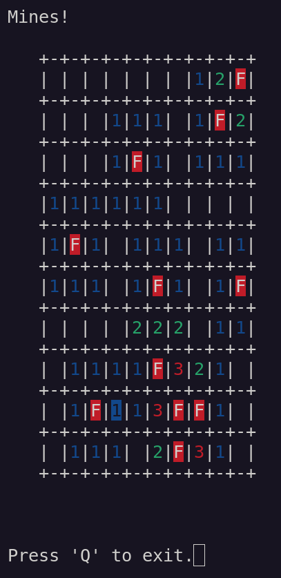

## ncurses port

Actively tested on a Debian 11 GNU+Linux text terminal, but may also work on other systems with the `ncurses` library.

### Build & runtime/debug dependencies

* gcc compiler
* ncurses lib
* a text terminal supporting ANSI colors
