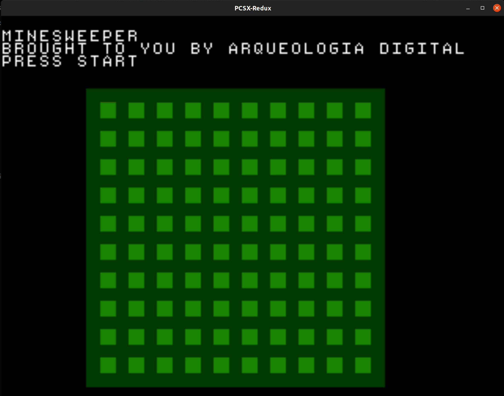
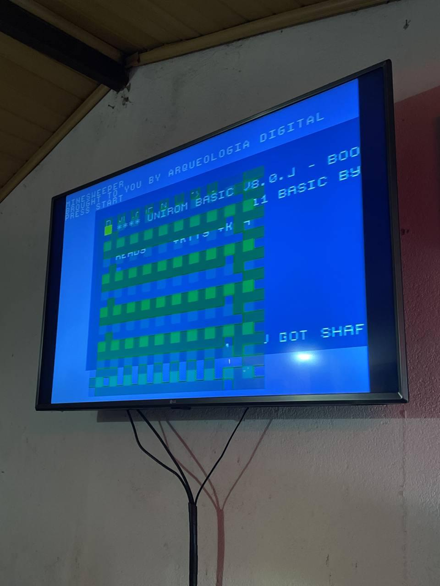

# PSX Port

Using [PSn00bSDK](https://github.com/Lameguy64/PSn00bSDK).




## Installing the SDK

**Do it preferably on your /tmp**
**Steps written for Ubuntu/Debian**

- If you're on Ubuntu/Debian, run this to install deps

```sh
# Install deps
sudo apt install git build-essential make ninja-build

# Warning: this will uninstall your current version of cmake! 

sudo apt purge cmake

# Installing cmake

wget https://github.com/Kitware/CMake/releases/download/v3.24.0-rc2/cmake-3.24.0-rc2-linux-x86_64.tar.gz
tar xzvf cmake-3.24.0-rc2-linux-x86_64.tar.gz
sudo cp cmake-3.24.0-rc2-linux-x86_64/bin/* /usr/local/bin
sudo cp -R cmake-3.24.0-rc2-linux-x86_64/share/* /usr/local/share

# Testing cmake
cmake --version
```

- Install mipsel

```sh
sudo mkdir /usr/local/mipsel-none-elf
cd /usr/local/mipsel-none-elf
sudo wget https://github.com/Lameguy64/PSn00bSDK/releases/download/v0.19/gcc-mipsel-none-elf-11.1.0-linux.zip
sudo unzip gcc-mipsel-none-elf-11.1.0-linux.zip
```

- Clone the repo for [PSn00bSDK](https://github.com/Lameguy64/PSn00bSDK) and init submodules and compile/install

```sh
git submodule update --init --recursive
cmake --preset default .
cmake --build ./build

# Don't worry, this will install to /usr/local
sudo cmake --install ./build
```

## Installing the emulator

Download the [pcsx-redux](https://github.com/grumpycoders/pcsx-redux) emulator from [here](https://install.appcenter.ms/orgs/grumpycoders/apps/pcsx-redux-linux64/distribution_groups/public)

Unzip and then run the .AppImage file.

Copy the .AppImage file to your /usr/local/bin

```sh
sudo cp PCSX-Redux-HEAD-x86_64.AppImage /usr/local/bin/pcsx-redux
```

## Building the project

```sh
export PSN00BSDK_LIBS=/usr/local/lib/libpsn00b/
make build
```

You can then open PCSX-Redux, click on File > Open ISO, then select the file on build/mines.bin. Then, click on Emulation > Run.

You can also burn the build to a CD or load it on your favorite emulator.

Alternatively, if you have PCSX on your PATH, you can just run `make run`.

## Running on real hardware

Follow this [tutorial](https://www.schnappy.xyz/?building_a_serial_psx_cable) to make your own serial cable. 

Finding a link cable in Brazil can be tricky, your best bet is to find one on MercadoLivre. 

Download UNIROM from [here](https://github.com/JonathanDotCel/unirom8_bootdisc_and_firmware_for_ps1/releases) and burn it to a CD. Also, clone [nops](https://github.com/JonathanDotCel/NOTPSXSerial) and install [mono](https://www.monodevelop.com/download/). 

You can test the cable by trying to find RX and GND first. Make your connections (using a breadboard) (remember that the TX on the serial cable end should go to RX) and turn on the PlayStation with the Unirom CD inside. Keep `screen /dev/ttyUSB0 115200` running with your FTDI connected. If you've got the RX and GND right, you should see the message `Unirom TTY redirect installed!`. If not, change the cable and restart the console. 

To test TX, you can try to upload the .exe file from the build directory using nops. Go to the nops directory, copy mines.exe to there, then:

```sh
mono nops.exe /exe mines.exe /m /dev/ttyUSB0
```

If you've got TX right, you should see `Sending chunk...` messages on your terminal and hopefully the game should start.
