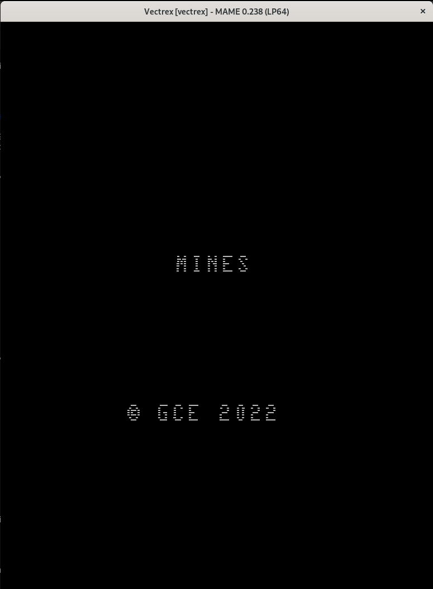

## Vectrex port

- Tested with MAME (you can use the `make run` for that)
- Currently broken. Needs more work to at least figure out which Vectrex BIOS routines are useful for drawing vectors on the screen.
- Current linking rules are not ideal as the RAM address range ends up being included in the ROM file, which is incorrect.
- There may be a way of making cartridges larger than 8Kbytes. For now the Makefile simply crops the generated ROM file (mines.vec) to get rid of those higher addresses used by RAM. This ugly hack needs to be properly fixed.
- The built ROM does boot on MAME's vectrex driver and the game name can be seen on the splash screen, meaning that at least the ROM headers seem fine.

### Build & runtime/debug dependencies

- cd devel/
- mkdir gitlab_dfffffff_gcc6809
- cd gitlab_dfffffff_gcc6809
- git clone https://gitlab.com/dfffffff/gcc6809.git
- cd gcc6809/     ; note: default branch is "dftools"
- cd build-6809/
- sudo apt install libgmp-dev libmpfr-dev
- make everything

- cd cd gitlab_dfffffff_gcc6809
- git clone https://gitlab.com/dfffffff/newlib-6809.git
- cd newlib-6809/
- cd build/
- ; edit the file `newlib.6809` substituting `target:-m6809-sim-none` by `target:-m6809-unknown-none`
- ; and also substituting `target_arg:-m6809sim` by `target_arg:-m6809unknown`
- ./newlib.6809 config  ; note: configure: WARNING: unrecognized options: --enable-multilib, --disable-malloc-debugging, --with-gnu-ld, --without-pic, --enable-target-optspace, --enable-newlib-iconv
- ./newlib.6809 make
- sudo ./newlib.6809 install
